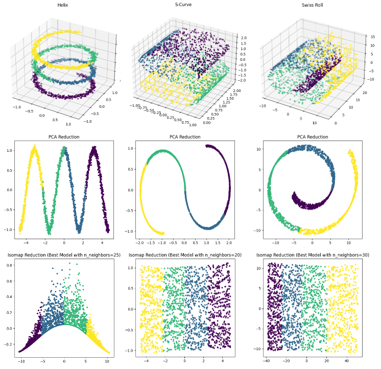

# Comparative Study: PCA vs Isomap

This repository presents a detailed comparative analysis between two well-established dimensionality reduction techniques: Principal Component Analysis (PCA) and Isomap. This study encompasses both artificial and real datasets, providing unique insights into the performances and characteristics of each method.

## Abstract

This study assesses the performance of PCA and Isomap on artificial datasets and the well-known high-dimensional MNIST dataset. The methods were tested on artificial structures such as the Swiss Roll, Helix, and S-Curve. The comparison relies on four criteria: 2D visualization after reduction, the nearest neighbor method (1-NN), trustworthiness, and continuity. Our results highlight the effectiveness of each technique in various data configurations and provide a comparison based on reliable and robust indicators.

## Main results of the study 

Our study aimed to offer a thorough and robust comparison of PCA and Isomap performance in dimensionality reduction tasks. Initially, our focus was on artificial datasets, where results indicated both models exhibit similarly high performance. Contrary to the prevailing theory that PCA struggles with non-linear data, our findings showed little distinction in performance metrics between the two methods. This aligns with Van der Maaten et al., (2009), although our PCA demonstrated a superior generalization error metric, possibly due to our distinct data generation or metric computation methods.

Our visualization highlighted the capabilities and limitations of each method in preserving data structures during dimension reduction. While PCA, a linear technique, offers what may seem like "simplified" representations, this might imply data information loss, making it potentially suboptimal for certain datasets. Conversely, Isomap excellently unfolded datasets like Swiss Roll and S-Curve but struggled with the Helix set, indicating some structures pose challenges even for non-linear techniques.

When testing on real MNIST data, our findings became more nuanced. PCA displayed impressive robustness, capturing dominant linear trends in real data. Isomap, despite excelling with artificial datasets, was less robust than PCA with real data but performed better in generalization error, suggesting a superior preservation of intrinsic data relationships that might be oversimplified by PCA. Notably, the generalization error rate notably increased for both models from artificial to real datasets. Our results align with Van der Maaten et al., who found PCA had better performance on the MNIST dataset.

In conclusion, our study illuminated the behavior of PCA and Isomap models in simulated and real-world contexts. We identified strengths and weaknesses of both models across different experimental scenarios, underscoring the importance of not solely relying on metric scores and considering the specific context. In some cases, combining these methods might harness their individual strengths. Ultimately, our research emphasizes the need for careful selection of data analysis tools, acknowledging each method's pros and cons.



## Repository Contents

1. `ManifoldProject.pdf`: The primary document containing an in-depth discussion, experimentations, visualizations, and results of this comparative study.


2. `Experiments/`: This folder contains Jupyter notebooks that were used to conduct experiments on different datasets.
   - `Helix.ipynb`: Experiments and analyses on the Helix dataset.
   - `SwissRoll.ipynb`: Experiments and analyses on the Swiss Roll dataset.
   - `S-Curve.ipynb`: Experiments and analyses on the S-Curve dataset.
   - `MNIST.ipynb`: Experiments and analyses on the renowned MNIST dataset.
  
## Keywords

- Dimensionality Reduction
- Principal Component Analysis (PCA)
- Isomap
- Trustworthiness
- Continuity
- 1-NN

## How to Run the Notebooks

1. Ensure you have [Jupyter Notebook](https://jupyter.org/install) installed.
2. Clone this repository.
3. Navigate to the `Experiments` folder and launch Jupyter Notebook
4. Open the desired notebook and run the cells to see the analyses and results.

## Packages Required

To successfully run the experiments and notebooks provided in this repository, the following packages are essential:

- `numpy`: For numerical operations and linear algebra.
- `pandas`: For data manipulation and analysis.
- `matplotlib`: For creating visualizations and plots.
- `scikit-learn` (often imported as `sklearn`): For machine learning and data mining tasks, including PCA.
- `scipy`: For additional scientific computing capabilities.
- `jupyter`: For running and viewing the `.ipynb` notebook files.
- `coranking`: For evaluating the quality of dimensionality reduction based on ranking metrics.

To install all the required packages, you can use the following pip command:

```bash
pip install numpy pandas matplotlib scikit-learn scipy jupyter coranking
````

## Data link

MNIST data we used in this study are available here:
[Kaggle Dataset](https://www.kaggle.com/datasets/hojjatk/mnist-dataset?select=train-labels.idx1-ubyte)

## References

- Zhang, Y., Shang, Q., & Zhang, G. (2021). pyDRMetrics - A Python toolkit for dimensionality reduction quality assessment. Heliyon, 7(2), e06199. https://doi.org/10.1016/j.heliyon.2021.e06199

- Das, Suchismita & Pal, Nikhil. (2020). NonlinearDimensionality Reduction for Data Visualization: An Unsupervised Fuzzy Rule-based Approach.
  
- van der Maaten, L., Postma E., & van den Herik J. (2009). Dimensionality Reduction: A Comparative Review.

- S. Marsland, “Machine Learning: An Algorithmic Perspective”, 2nd edition, Chapter 6, 2014. https://homepages.ecs.vuw.ac.nz/~marslast/Code/Ch6/lle.py
  
- Lee, John A., and Michel Verleysen. “Quality assessment of dimensionality reduction: Rankbased criteria.” Neurocomputing 72.7 (2009): 1431-1443.

## Other

Import MNIST function is available here: 
[Github](https://github.com/shukali/dimensionalityreduction-comparison/tree/master)

1-NN function is available here:
[Github](https://github.com/MaayanLab/GraphDR/tree/master)

## Cite

Babey, C. (2023). Reduction de dimension : Une étude comparative de l’ACP 
et de l’Isomap sur des données non-linéaires.

## Contact

For any inquiries or further discussion about this project:

- **GitHub**: Feel free to open an issue or send me a direct message here on GitHub.
- **LinkedIn**: Connect with me or send me a message on [LinkedIn](https://www.linkedin.com/in/cassienbabey/).

I appreciate feedback and collaboration, so please don't hesitate to reach out!
